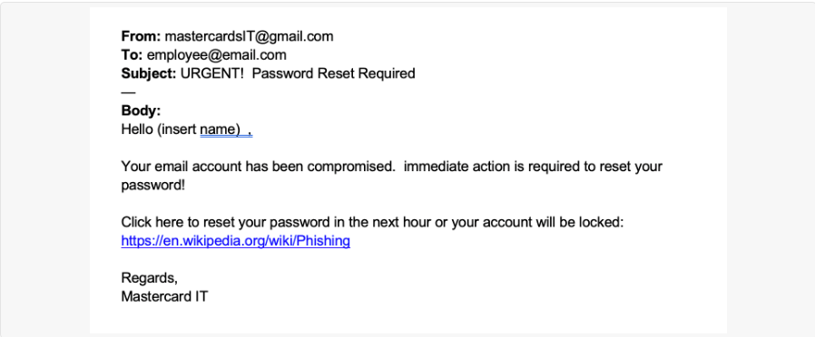
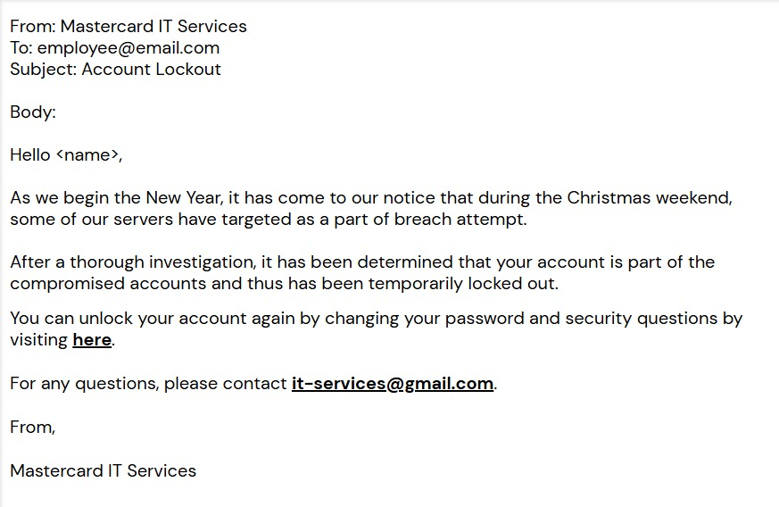
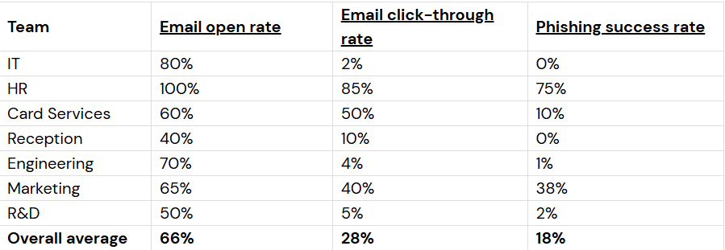
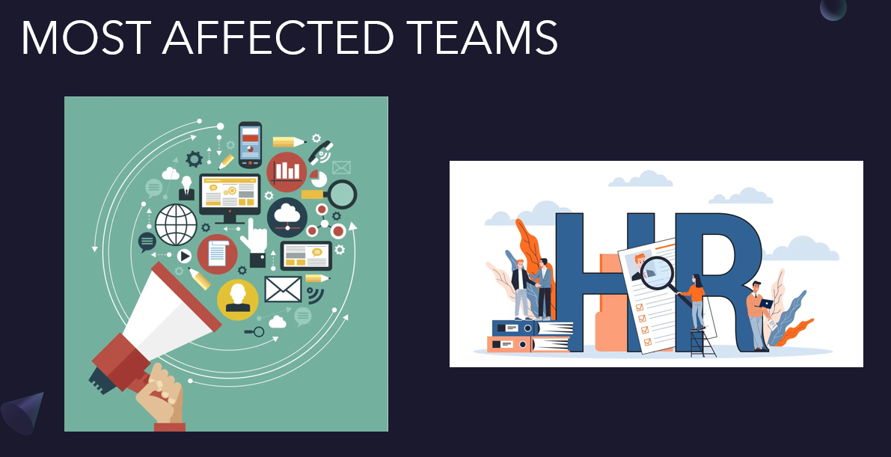
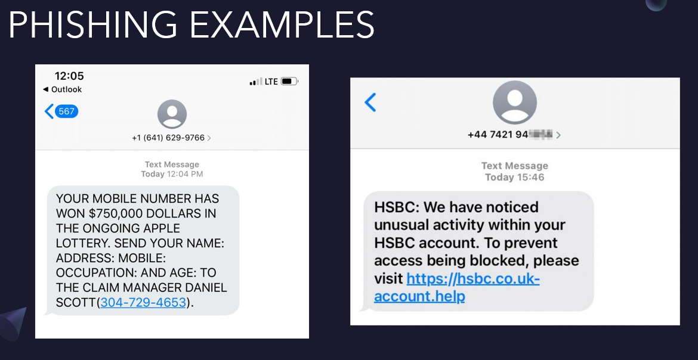
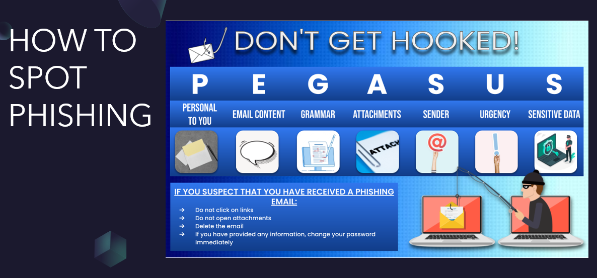
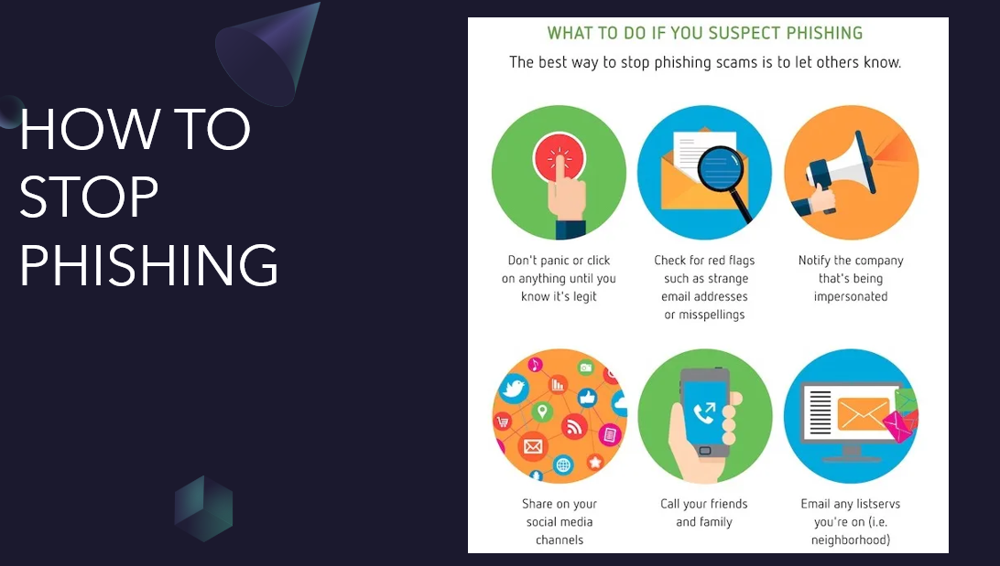

# Forage Simulations - Mastercard

Today, as an Analyst in Mastercard's Security Awareness Team we will be implementing a phishing simulation campaign and build awareness on how to mitigate phishing.

One of the most common threats organizations face today is phishing. So, what is phishing?

* Phishing is the act of pretending to be someone to get information, mostly passwords.
* Attackers can send links to infect system with malicious software to steal financial information, system credentials or other sensitive data.

Let us look at an example of a phishing email:

At a first glance, you can see some issues which make this email look fake.
* The email address of the sender looks suspicious.
* The sloppy layout and obvious grammatical errors.

Your first task is to make this email look more believable, as your Manager wants you to lead the next phishing simulation campaign.

Some of the changes you can make the email look genuine are:
* Make the sender's email address look legitimate.
* Add context to the beginning of the message.
* Use correct spelling and grammar.
* Mask the hyperlink with text.

Let us make these changes and look at the results:

Now that the changes have been made, we can run a phishing simulation campaign and analyze the results to see the failure rate of each department. With these results we can,
* **Identify** which departments need more awareness and
* **Design** and **implement** the appropriate training for those teams.

First, let us take a look at the results of the phishing campaign.

With this table, we can identify which teams are more likely to fall for a phishing email:
* **Email open rate**: The percentage of people of who opened the phishing email
* **Email click-through rate**: The percentage of people who clicked on the link.
* **Phishing success rate**: The percentage of people who clicked on the link and inputted some information.

Now that we have analyzed the results, it's time to create a presentation to provide awareness and training to the teams which are the most susceptible.

With this simulation we have learnt how to identify phishing emails and run a phishing simulation campaign. We have also learnt how to interpret results and develop a training plan.
