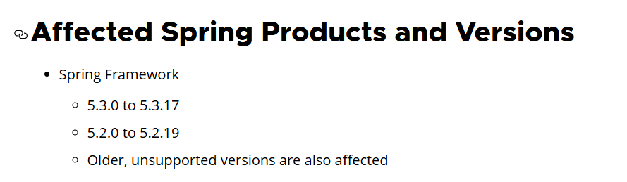
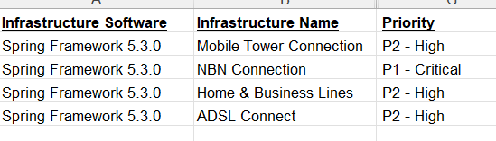
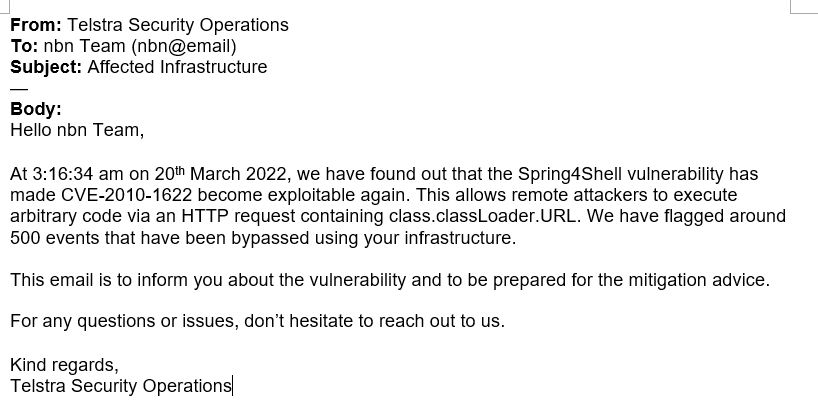
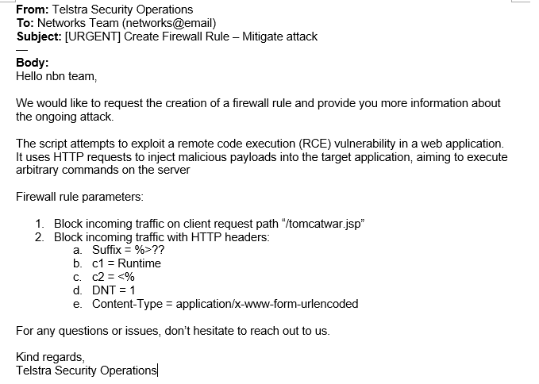
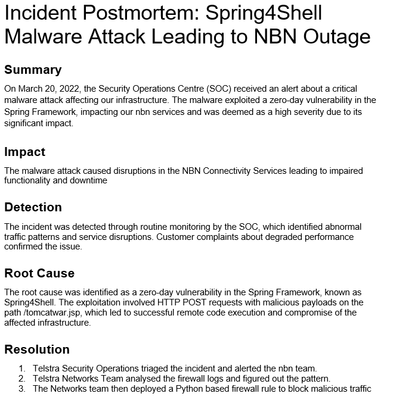

# Forage Simulations - Telstra

Today, as an **Information Security Analyst** of Telstra's Security Operations Centre, we will responding, analyzing and mitigating a malware attack. We will also be providing a post-incident report.

## Task 1 - Responding to a malware attack
* Your task is to triage the current malware threat and figure out which infrastructure is affected.
* Afterwards, draft an email to the respective team alerting them of the current attack so that they can begin an incident response.
* Make sure to include the timestamp of when the incident occurred.
* The purpose of this email is to ensure the respective team is aware of the ongoing incident and to be prepared for mitigation advice.

### Resources
* We are given resources, which should be able to help us determine the affected infrastructure.
* Those resources are advisories provided by CVE and CISA on the zero-day vulnerability.

* This gives us the list of affected frameworks for the different teams.
* We are also provided with firewall logs and infrastructure list with the priority list.

* We can see that **NBN Connection** infrastructure has the highest priority of **P1**.
* We can also see that around **500** events have been bypassed beginning from the timestamp **20–03–2022 T 03:16:34**.
* Since, we have figured out the team which is affected, let us draft an email for the affected team.

* Thus, we have notified the affected team about the vulnerability.

## Task 2 - Analysing the Attack
* In this task, we are going to analyze the firewall logs and identify the characteristics of the Spring4Shell vulnerability.
* Then, we will draft an email to the networks teams, so that they can develop a firewall rule to mitigate the attack.

### Resources
* Along with the firewall logs, we are also provided with the code which executes the attack.

### Attack
* Analyzing the code gives the method of attack.
* This script uses HTTP requests to inject malicious payloads into the target application, aiming to execute arbitrary commands on the server.
* The payload is designed to create a malicious JSP file (tomcatwar.jsp) on the server.
* After sending the payload, it constructs a URL (shellurl) pointing to the uploaded JSP file. 
* If successful, this URL can be used to execute commands remotely.

* Once, we are done with analyzing, let us draft an email to the networks team.

* Thus, we have created a firewall block rule.

## Task 3 - Mitigate the malware attack
* In this task we will be working the network team to implement a firewall rule using Python.
* We will simulate the firewall's scripting language by using an HTTP Server.
* Based on the starter code and the parameters we used to implement a block rule, we have developed a code to block malicious requests.
* **NOTE: Look at Firewall.py in Assets**

## Task 4 - Incident Postmortem
* We have finished implementing our rule script and successfully stopped the attack.
* Our final task is to create an incident postmortem of the malware attack, covering the details of the attack.

